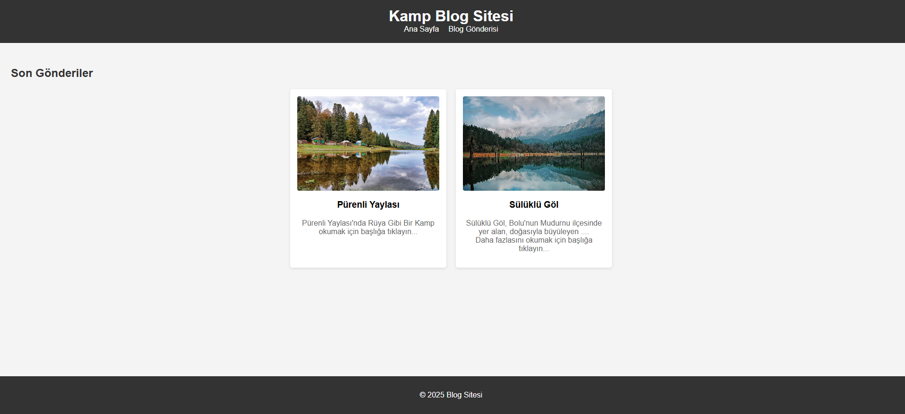

# 🏕️ Kamp ve Doğa Temalı Blog Sitesi

## 📌 Proje Tanımı

Bu proje, **HTML** ve **CSS** kullanılarak geliştirilmiş, kamp ve doğa temalı basit bir blog sitesidir. Blog sitesi; bir ana sayfa ve iki ayrı blog gönderisi sayfası içerir.

- Ana Sayfa: `index.html`
- Blog Gönderisi 1: `post1.html` (Pürenli Yaylası)
- Blog Gönderisi 2: `post2.html` (Sülüklü Göl)

---

## 🧱 Blog Görünümü

---

## 🎨 Tasarım Kuralları

- **Arka Plan:** `#f4f4f4`
- **Başlık ve Footer:** `#333`
- **Yazı Tipi:** Arial, sans-serif
- **Başlık Rengi:** `#333`
- **Paragraf Rengi:** `#666`
- **Kartlar:**
  - Beyaz zemin
  - `border-radius`
  - `box-shadow` efekti

---

## 🔧 Teknik Özellikler

- HTML5 semantik etiketleri: `<header>`, `<nav>`, `<main>`, `<footer>`, `<article>`, `<ul>`, ``, `<a>`, `<h1>`, `<h2>`, `
`
- Responsive yapı için `flexbox` ve `@media` kullanımı
- Menü linkleri için `text-decoration: none`
- Tüm sayfalarda ortak `style.css` kullanımı
- Footer her zaman sayfa altında kalacak şekilde konumlandırılmıştır

---

